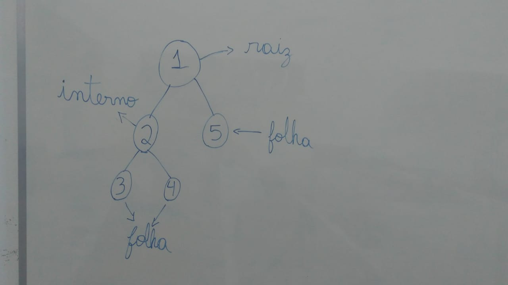

# O que é uma árvore para programação? 
Uma arvore é, para programação, uma forma de representar os dados de forma que você vai ter vários nós e cada um deles ganha um nome que são: *raiz*, *interno*, *folha*
  - O nó raiz é o primeiro nó da árvore, toda árvore parte dele e a partir dele você consegue chegar em qualquer nó da árvore, ou seja, ele não tem nenhum antecessor e é antecessor de todos os nós da àrvore
  - Nós folhas são os nós que não tem nenhum filho (ou sucessor), ou seja, eles vão estar na ponta da árvore.
  - Nós internos são aqueles que não são raiz, mas que também não são folhas, ou seja, estão no meio da árvore.

> Veja abaixo um exemplo de como seria representada uma árvore e seus nós:


## Nó pai e nó filho
O nó pai é o nó que imediatamente anterior ao outro, todo nó - exceto a raiz da árvore - tem um nó pai.
O nó filho é o nó imediatamente sucessor ao nó pai, todo nó da árvore tem pelo menos um filho - exceto as folhas.
Voltando para o exemplo acima:
O nó *1* não tem pai, pois é a raiz da árvore e é pai dos nós *2* e *5*.
O nó *2* é filho do nó *1* e é pai dos nós *3* e *4*
Os nós *3* e *4* são filhos do nó *2* e não são pais de ninguém, pois - assim como o nó *5* (filho do nó *1*) - é uma folha.

## Altura de uma árvore

A altura de uma árvore é o maior caminho que você faz asindo da raiz da árvore e indo até uma das folhas, por exemplo, a altura da àrvore da imagem acima é 3, pois a maior distância entre caminhos da àrvore é sair da raiz (*1*) e ir ou para a folha *3* ou para a folha *4* passando por *2*, também é possivel chegar à uma folha indo de *1* para *5*, contudo, por não ser *A MAIOR DISTÂNCIA POSSIVEL* não é considerada a altura da arvore.

> Veja abaixo mais exemplos de árvores com foco na altura das árvores


## Como implementar
A implementação se dará com uma struct que diz a posição do filho a esquerda e a direita do nó e, possivelmente - dependendo da questão - algum elemento a mais, a struct terá a seguinte forma:
```C
typedef struct tree tree;
struct tree {
	int esquerda, direita;
};
```
Para caminhar na ávore basta ir, recursivamente,  para o nó da esquerda e depois para o nó da direita do nó atual - iniciando da raiz, se eu quero exibir todos os nós da árvore, uma maneira de fazer é:
```C
void print_tree(tree t[], int no_atual) {
	if(no_atual == -1) {
		return;
	}
	printf("%d\n", no_atual);
	print_tree(t, t[no_atual].esquerda);
	print_tree(t, t[no_atual].direita);
}
```
Essa forma de exibir uma árvore é chamada de pré-ordem, veja mais em: [formas clássicas de percorrer uma árvore](https://br.spoj.com/problems/PREEMPOS/)

## Questões para resolver:
1. [Mas que árvore estranha](http://thehuxley.com/problem/786)
2. [Pais das folhas](http://thehuxley.com/problem/929)
3. [Em cada nível da árvore](http://thehuxley.com/problem/949?quizId=4049)
